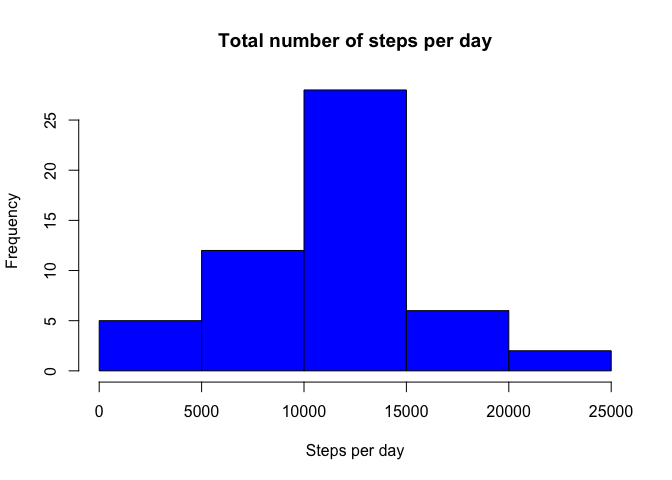
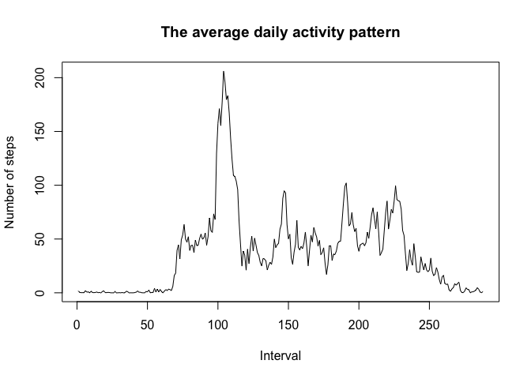
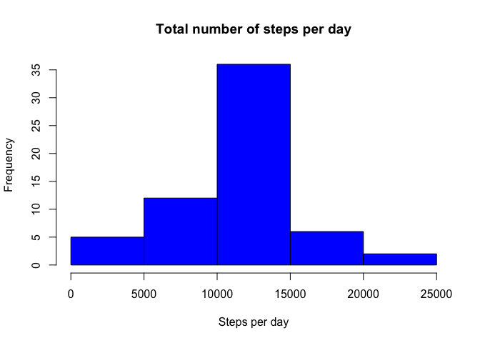
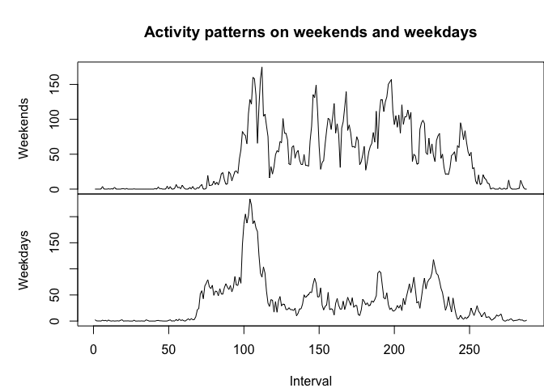

# Reproducible Research: Peer Assessment 1

Setting up Global knitr options

```r
library(knitr)
opts_chunk$set(echo = TRUE)
```

## Loading and preprocessing the data


```r
activity <- read.csv("activity.csv", header = TRUE)
```


## What is mean total number of steps taken per day?

Find the total number of steps taken per day


```r
TotalStepsPerDay <- tapply(activity$steps, activity$date, FUN = sum)
```

Plot histogram of the total number of steps taken per day


```r
hist(TotalStepsPerDay, breaks = 6, main = "Total number of steps per day",
     xlab = "Steps per day", ylab = "Frequency", col = "blue")
```

 

Compute the mean and median total number of steps per day


```r
mean(TotalStepsPerDay, na.rm = TRUE)
```

```
## [1] 10766.19
```

```r
median(TotalStepsPerDay, na.rm = TRUE)
```

```
## [1] 10765
```


## What is the average daily activity pattern?

Find the average number of steps taken per 5-minute interval


```r
MeanStepsPerInterval <- tapply(activity$steps, activity$interval, mean, na.rm = TRUE)
```

Make a time series plot of the 5-minute interval (x-axis) and the average number of steps taken, averaged across all days (y-axis)


```r
plot(MeanStepsPerInterval, type = "l", main = ("The average daily activity pattern"), 
    ylab = "Number of steps", xlab = "Interval")
```

 

Find the 5-minute interval which, on average across all the days in the dataset, contains the maximum number of steps?


```r
maxInterval <- which.max(MeanStepsPerInterval)
names(maxInterval)
```

```
## [1] "835"
```


## Imputing missing values

Find the total number of missing values in the dataset


```r
sum(as.numeric(is.na(activity$steps)))
```

```
## [1] 2304
```

* Devise a strategy for filling in all of the missing values in the dataset. The strategy does not need to be sophisticated. For example, you could use the mean/median for that day, or the mean for that 5-minute interval, etc.

* Create a new dataset that is equal to the original dataset but with the missing data filled in.

* Make a histogram of the total number of steps taken each day and Calculate and report the mean and median total number of steps taken per day. Do these values differ from the estimates from the first part of the assignment? What is the impact of imputing missing data on the estimates of the total daily number of steps?


```r
MeanStepsPerInterval_vec <- as.vector(MeanStepsPerInterval)
MeanStepsPerInterval_vec <- rep(MeanStepsPerInterval_vec, 61)
MeanStepsPerInterval_vec[!is.na(activity$steps)] = 1

stepsData_vec <- as.vector(activity$steps)
stepsData_vec[is.na(stepsData_vec)] = 1

activity_NoMissData <- activity
activity_NoMissData$steps <- MeanStepsPerInterval_vec * stepsData_vec
TotalStepsPerDay_NoMissData <- tapply(activity_NoMissData$steps, activity_NoMissData$date, 
    sum)
hist(TotalStepsPerDay_NoMissData, breaks = 6, main = "Total number of steps per day", 
    xlab = "Steps per day", ylab = "Frequency", col = "blue")
```

 


Find the mean and median total number of steps taken per day.


```r
mean(TotalStepsPerDay_NoMissData)
```

```
## [1] 10766.19
```

```r
median(TotalStepsPerDay_NoMissData)
```

```
## [1] 10766.19
```

The imputation has a slight impact on the median total number of steps taken per day. It was changed from 10765 to 10766.19 

The mean total number of steps taken per day remained the same. 


## Are there differences in activity patterns between weekdays and weekends?

* Create a new factor variable in the dataset with two levels – “weekday” and “weekend” indicating whether a given date is a weekday or weekend day.


```r
# Create a factor variable with two levels (weekday, weekend)
temp <- as.POSIXlt(activity$date, format = "%Y-%m-%d")
WeekDay <- temp$wday
WeekDay[WeekDay == 0] = 0
WeekDay[WeekDay == 6] = 0
WeekDay[WeekDay != 0] = 1
WeekDays_Factor <- factor(WeekDay, levels = c(0, 1))
activity$WD <- WeekDays_Factor

#Calculate the mean
MeanStepsPerWeekday <- tapply(activity$steps, list(activity$interval, activity$WD), mean, 
    na.rm = T)
```

* Make a panel plot containing a time series plot (i.e. type = "l") of the 5-minute interval (x-axis) and the average number of steps taken, averaged across all weekday days or weekend days (y-axis). See the README file in the GitHub repository to see an example of what this plot should look like using simulated data.


```r
par(mfrow = c(2, 1))
# Display the two plots
with(activity, {
    par(mai = c(0, 1, 0.8, 0))
    plot(MeanStepsPerWeekday[, 1], type = "l", main = "Activity patterns on weekends and weekdays", 
        xaxt = "n", ylab = "Weekends")
    
    par(mai = c(0.8, 1, 0, 0))
    plot(MeanStepsPerWeekday[, 2], type = "l", xlab = "Interval", ylab = "Weekdays")

})
```

 


